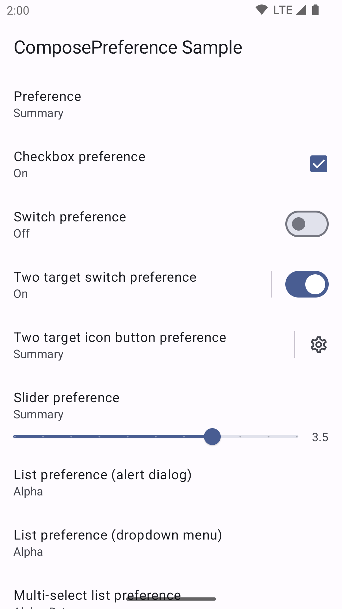
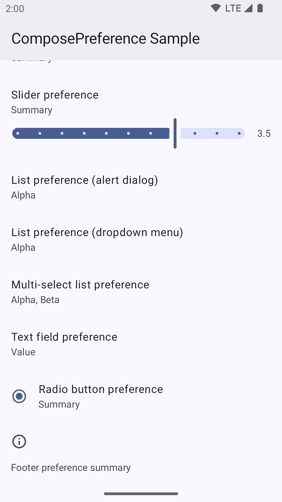

# Compose Preference

[](https://github.com/zhanghai/ComposePreference/actions) [](https://github.com/zhanghai/ComposePreference/releases) [](LICENSE)

       

[Preference](https://developer.android.com/develop/ui/views/components/settings) implementation for [Jetpack Compose](https://developer.android.com/jetpack/compose) [Material 3](https://developer.android.com/jetpack/compose/designsystems/material3).

This is not an officially supported Google product.

## Preview

<p> </p>

## Integration

Gradle:

```kotlin
implementation("me.zhanghai.compose.preference:preference:2.0.0")
```

## Design

There is no official and complete Material 3 UX specification for preference yet, so the UX design of this library mainly comes from the following sources:

- [Material Design 3](https://m3.material.io/)
- [Material Design 2 Android Settings](https://m2.material.io/design/platform-guidance/android-settings.html)
- [Android settings design guidelines](https://source.android.com/docs/core/settings/settings-guidelines)
- [AndroidX Preference](https://developer.android.com/jetpack/androidx/releases/preference)
- [AOSP Settings](https://android.googlesource.com/platform/packages/apps/Settings/+/refs/heads/main/)

## Usage

This library is designed with both extensibility and ease-of-use in mind.

Basic usage of this library involves invoking the `ProvidePreferenceLocals` composable, and then calling the `*Preference` helper functions in a `LazyColumn` composable:

```kotlin
AppTheme {
    ProvidePreferenceLocals {
        // Other composables wrapping the LazyColumn ...
        LazyColumn(modifier = Modifier.fillMaxSize()) {
            switchPreference(
                key = "switch_preference",
                defaultValue = false,
                title = { Text(text = "Switch preference") },
                icon = { Icon(imageVector = Icons.Outlined.Info, contentDescription = null) },
                summary = { Text(text = if (it) "On" else "Off") }
            )
        }
    }
}
```

### Preferences

Built-in types of preferences include:

- [`Preference`](library/src/main/java/me/zhanghai/compose/preference/Preference.kt)
- [`PreferenceCategory`](library/src/main/java/me/zhanghai/compose/preference/PreferenceCategory.kt)
- [`CheckboxPreference`](library/src/main/java/me/zhanghai/compose/preference/CheckboxPreference.kt)
- [`FooterPreference`](library/src/main/java/me/zhanghai/compose/preference/FooterPreference.kt)
- [`ListPreference`](library/src/main/java/me/zhanghai/compose/preference/ListPreference.kt) (supports both alert dialog and dropdown menu)
- [`MultiSelectListPreference`](library/src/main/java/me/zhanghai/compose/preference/MultiSelectListPreference.kt)
- [`RadioButtonPreference`](library/src/main/java/me/zhanghai/compose/preference/RadioButtonPreference.kt)
- [`SliderPreference`](library/src/main/java/me/zhanghai/compose/preference/SliderPreference.kt)
- [`SwitchPreference`](library/src/main/java/me/zhanghai/compose/preference/SwitchPreference.kt)
- [`TextFieldPreference`](library/src/main/java/me/zhanghai/compose/preference/TextFieldPreference.kt)
- [`TwoTargetIconButtonPreference`](library/src/main/java/me/zhanghai/compose/preference/TwoTargetIconButtonPreference.kt)
- [`TwoTargetSwitchPreference`](library/src/main/java/me/zhanghai/compose/preference/TwoTargetSwitchPreference.kt)

Each type of built-in preference includes 3 kinds of APIs:

1. A `LazyListScope.*Preference` extension function, which is the easiest way to use preferences in this library, and helps developers to avoid boilerplates like having to specify the key twice for the `LazyColumn` and the `Preference`.
2. A `*Preference` composable that takes a `MutableState`, which allows developers to bring in any kind of state they currently have.
3. A `*Preference` composable that takes `value` and `onValueChange`, which allows developers to use the preference without a state and even in non-preference scenarios.

### Theming

The visual appearance of the preferences can be customized by providing a custom [`PreferenceTheme`](library/src/main/java/me/zhanghai/compose/preference/PreferenceTheme.kt) with `preferenceTheme` to `ProvidePreferenceLocals` or `ProvidePreferenceTheme`.

Customizable values in the theme include most dimensions, colors and text styles used by the built-in preferences.

### Data source

The data source of the preferences can be customized by providing a custom `MutableStateFlow<Preferences>` to `ProvidePreferenceLocals` or `ProvidePreferenceFlow`.

The [`Preferences`](library/src/main/java/me/zhanghai/compose/preference/Preferences.kt) interface defined in this library is similar to the AndroidX DataStore [`Preferences`](https://developer.android.com/reference/kotlin/androidx/datastore/preferences/core/Preferences) class, but:

- It can be implemented by other mechanisms like [`SharedPreferences`](https://developer.android.com/reference/android/content/SharedPreferences), thanks to being a public interface instead of an abstract class with only an internal constructor.
- It doesn't have to be produced and updated via a [`DataStore`](https://developer.android.com/reference/kotlin/androidx/datastore/core/DataStore).
- It doesn't mandate a fixed set of types that an implementation has to support, so that implementations have the flexibility to support much more or less types. The implementations within this library supports most of the types supported by `SharedPreferences` **except for `Long`** (due to non-Android platforms).

The default data source provided by this library (`createDefaultPreferenceFlow()`) is implemented with [`SharedPreferences`](https://developer.android.com/reference/android/content/SharedPreferences) on Android (or [`NSUserDefaults`](https://developer.apple.com/documentation/foundation/userdefaults) on Apple, [`Preferences`](https://docs.oracle.com/javase/8/docs/api/java/util/prefs/Preferences.html) on JVM, and [`localStorage`](https://developer.mozilla.org/en-US/docs/Web/API/Window/localStorage) on Web), because:

- `SharedPreferences` is available as part of the Android framework, and doesn't require external dependencies like AndroidX DataStore which [bundles its own copy of `protobuf-lite`](https://cs.android.com/androidx/platform/frameworks/support/+/androidx-main:datastore/datastore-preferences-core/build.gradle;l=108;drc=9fd0cda7bb963d41fd25645b0761776caa830ed7).
- `SharedPreferences` can actually be [10x faster](https://stackoverflow.com/q/71601343) than AndroidX DataStore, likely due to its existing optimizations and simple threading and persistence model (XML is simple enough to be faster than Protobuf).
- `SharedPreferences` has a synchronous API, but it is actually async except for the first (un-cached) read, and allows in-memory value change without waiting for the disk write to complete, which is good for the preference use case.
- Existing users of `SharedPreferences` can use this library directly with the default data source.
- AndroidX DataStore doesn't support Kotlin/JS and Kotlin/Wasm yet.

**There should only be at most one invocation of `createDefaultPreferenceFlow()`**, similar to creating `DataStore` in AndroidX DataStore. It is also only for usage within a single process due to being backed by `SharedPreferences`.

If AndroidX DataStore is considered more appropriate for your use case, e.g. you need multi-process support, you can also create an AndroidX DataStore backed implementation that provides a `MutableStateFlow<Preferences>` on your own.

## License

    Copyright 2023 Google LLC

    Licensed under the Apache License, Version 2.0 (the "License");
    you may not use this file except in compliance with the License.
    You may obtain a copy of the License at

        https://www.apache.org/licenses/LICENSE-2.0

    Unless required by applicable law or agreed to in writing, software
    distributed under the License is distributed on an "AS IS" BASIS,
    WITHOUT WARRANTIES OR CONDITIONS OF ANY KIND, either express or implied.
    See the License for the specific language governing permissions and
    limitations under the License.
